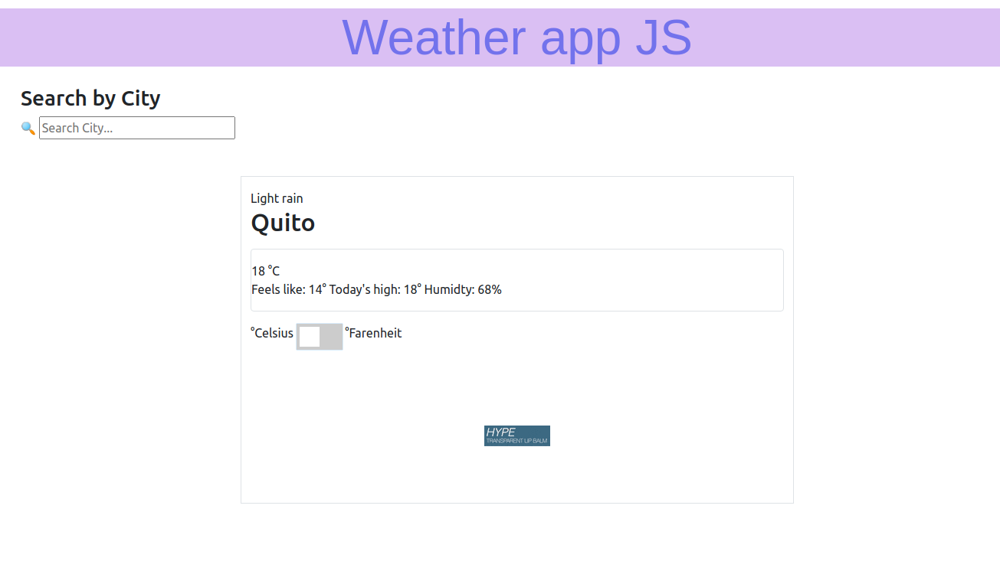

# Project Weather App

This project was build to test my abilities of the lessons about:

- Using APIs
- Working with JSON files
- Await and Async functions 



## Built With

- Bootstrap
- Javascript

## Live Demo

[Live Demo Link](https://rawcdn.githack.com/alejandrotoledoweb/js-weather-app/7eae277ce1d033d80a17ed78abd3f79bd009cdf9/dist/index.html)

## Getting Started

**To get a copy of the code please click on the green button on the top right corner that says code**
**And run in your console `https://github.com/alejandrotoledoweb/js-weather-app.git`**

### Prerequisites

- nodejs
- npm
- webpack

### Usage

After cloning the repo in your local environment please run this command:

```npm install```

After installing all the dependencies, please build the app with this command:

```npm run build```

Then run this command and open the `index.html` file with the live server of your choice:

```npm run watch```

## Author

👤 **Alejandro Toledo**

- GitHub: [@alejandrotoledoweb](https://github.com/alejandrotoledoweb)
- Twitter: [@alejot](https://twitter.com/alejot)
- LinkedIn: [Alejandro Toledo](https://www.linkedin.com/in/alejandro-toledo-3b444b109/)

## 🤝 Contributing

Contributions, issues, and feature requests are welcome!

Feel free to check the [issues page](https://github.com/alejandrotoledoweb/js-weather-app/issues).

## Show your support

Give a ⭐️ if you like this project!

## 📝 License

This project is [MIT](lic.url) licensed.
